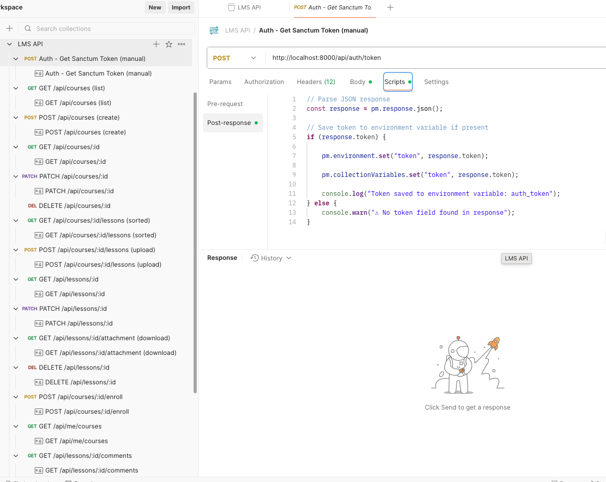
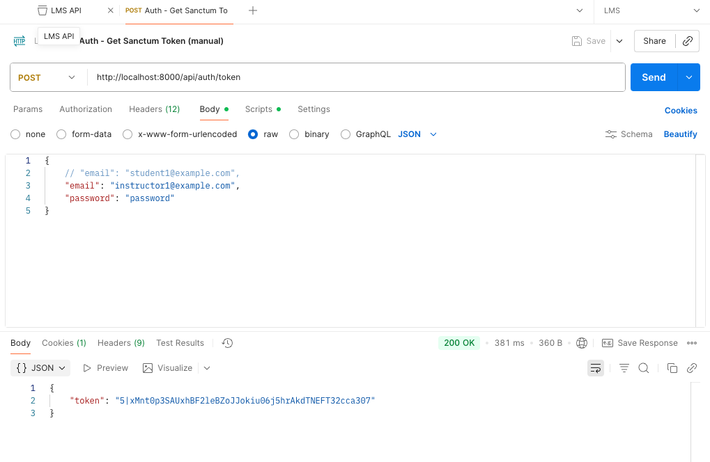
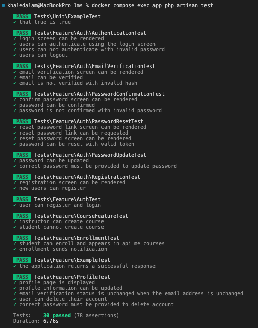

# Laravel Learning Management System (LMS)

A modern, containerized **Learning Management System (LMS)** built with **Laravel 12** and **PHP 8.3**, featuring complete instructor–student workflows, file attachments, comments, analytics dashboards, RESTful APIs, and real-time notifications — designed for clarity, scalability, and developer productivity.

---

## 🎥 Demo

📺 [Watch Demo on YouTube](https://youtu.be/ubniNnwUSlM)  

<video src="./docs/lms-demo-compressed.mp4" controls width="700">
  Your browser does not support the video tag.
</video>

---

## ✨ Features

### 🧑‍🏫 Core Functionality
- Role-based access: **Instructor** / **Student**
- Manage **Courses**, **Lessons**, **Comments**, and **Attachments**
- Enrollment system with **email notifications**
- Automatic **instructor notifications** on new comments
- Student **email confirmation** after enrollment
- Role-aware dashboards with **Chart.js analytics**
- Full-text **search & filtering**
- REST API endpoints with **Laravel Sanctum auth**

### ⚙️ Technical Highlights
- **Laravel 12** + **PHP 8.3**
- Blade UI templates (or optional API-only mode)
- SQLite database (for lightweight local setup)
- **Docker-based** environment
- Horizon + Redis queue processing
- Query caching via `Cache::remember()`
- Event-based cache invalidation
- **Telescope** + **Debugbar** for local profiling
- Optimized Eloquent scopes & relationships
- Fully seedable demo data

---

## 🐳 Docker Setup (with SQLite)

Local development is containerized for zero-friction setup — no MySQL required.

### 1️⃣ First-Time Setup
```bash
make setup
# OR
./scripts/setup_docker_sqlite.sh
```

This will:
1. Build and start containers  
2. Create SQLite DB  
3. Install dependencies  
4. Run migrations + seeders  
5. Build frontend assets (if Node container present)

Then visit → [http://localhost:8000](http://localhost:8000)

### 2️⃣ Useful Commands
```bash
# Start containers
docker compose up -d

# Enter PHP container
docker compose exec app bash

# Laravel commands
php artisan migrate --seed
php artisan cache:clear
php artisan telescope:install
```

---

## 🔑 Environment Variables (.env)

```env
APP_NAME="LMS"
APP_ENV=local
APP_DEBUG=true
APP_URL=http://localhost:8000

DB_CONNECTION=sqlite
DB_DATABASE=/var/www/html/database/database.sqlite

CACHE_STORE=redis
SESSION_DRIVER=file
QUEUE_CONNECTION=redis
```

---

## 📡 API Documentation

Comprehensive endpoint reference → [`docs/api.md`](docs/api.md)  
Ready-to-use Postman Collection → [`docs/LMS_API.postman_collection.json`](docs/LMS_API.postman_collection.json)



<br />



---

## 🧠 Key API Highlights

- **Authentication:** `/api/auth/token` → returns Sanctum token  
- **Courses:** Create, list, update, delete  
- **Lessons:** JSON + Multipart (attachments)  
- **Comments:** Nested under `/api/lessons/{lesson}/comments`  
- **Enrollments:** `/api/courses/{course}/enroll`  
- **Attachments:** Upload, replace, or delete with automatic `has_attachment` flag

---

## ⚡ Performance Optimizations
- Query-level caching with `Cache::remember()`
- Indexed DB columns for faster filtering
- Preloaded & counted Eloquent relationships
- Lazy collections for large datasets
- Cached dashboards & chart data
- Cache invalidation via model events

---

## 🧭 Monitoring & Debugging
Telescope and Debugbar are pre-configured for local profiling.

```bash
docker exec -it lms-app php artisan telescope:install
docker exec -it lms-app php artisan migrate
```

### Access
- **Telescope:** [http://localhost:8000/telescope](http://localhost:8000/telescope)  
- **Horizon:** [http://localhost:8000/horizon](http://localhost:8000/horizon)

### Example Job
```bash
docker compose exec app php artisan tinker
>>> dispatch((new \App\Jobs\SendEnrollmentEmail(
        \App\Models\User::first(),
        \App\Models\Course::first()
    ))->onQueue('default'));
```

### Reset Redis (Horizon)
```bash
docker compose exec redis redis-cli FLUSHALL
```

---

## 🧪 Testing

```bash
php artisan test
```



---

## 🧰 Development Checklist

- [x] Instructor/Student auth policies  
- [x] File uploads via `multipart/form-data`  
- [x] Token auto-save script for Postman  
- [x] Enrollment email queue  
- [x] Docker + SQLite setup  
- [x] Horizon & Telescope monitoring  
- [x] Chart.js dashboard analytics  
- [x] Complete REST API coverage  

---

## 📜 License
This project is licensed under the **MIT License** — free for personal or commercial use.

---

## 👤 Maintainer

**Khaled Alam**  
Full-Stack Software Engineer | Laravel · React · SaaS · PropTech  
🌐 [Portfolio](https://khaledalam.net)  
✉️ [khaledalam.net@gmail.com](mailto:khaledalam.net@gmail.com)  
LinkedIn: [linkedin.com/in/khaledalam](https://linkedin.com/in/khaledalam)
